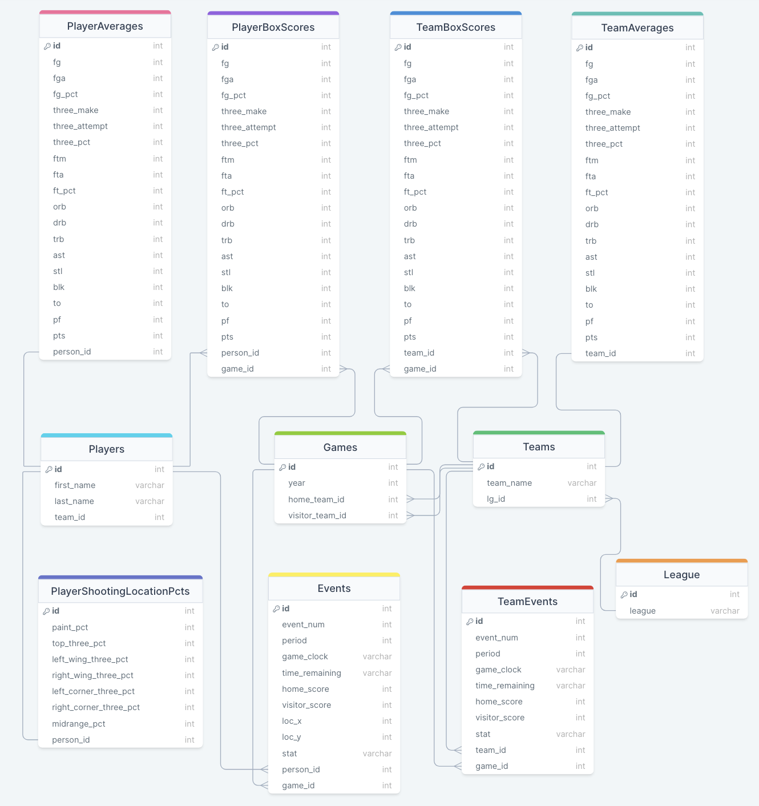

# EuroLeague 2022 Player / Team Analysis Application

## Features:

<br />

### 1) Team Per Game Statistics Table and Team Selector Dropdown Menu

- Select a team from the EuroLeague 2022 season in a dropdown menu
- View selected team's traditional per game averages


<br />
<br />

### 2) Team Game Totals and Season Average Line Graph

- Choose a traditional statistic from in dropdown menu
- Analyze a chosen team's game-by-game totals and track the change in their season average for a selected statistic
- Hover over a point on the line graph to view more detail in a tooltip


<br />
<br />

### 3) Player Per Game Statistics Table

- View a roster's traditional per game averages
- Sort roster by a particular statistic in ascending or descending order by clicking on a table header
- Click on a row to view Player Season Trends for a Selected Statistic


<br />
<br />

### 4) Player Season Trends for a Selected Statistic

- Choose a traditional statistic from in dropdown menu
- Analyze a chosen player's season trends for a selected statistic


  <br />
  <br />

### 5) Player Game Total and Season Average Line Graph

- Analyze a chosen player's game-by-game totals and track the change in their season average for a selected statistic
- Hover over a point on the line graph to view more detail in a tooltip


<br />
<br />

### 6) Player Percentage of Team Total Line Graph

- Analyze a player's contributed percentage of their team's game total for a selected statistic and track the change in their season average
- Hover over a point on the line graph to view more detail in a tooltip


<br />
<br />

### 7) Player Shooting Percentages per Location Bar Graph

- Upon selecting a shooting percentage in the 'Select Statistic' menu, a user can analyze a player's shooting percentages per location on the court
- Hover over a point on the bar graph to view more detail in a tooltip


<br />
<br />

## Methodology:

<br />
1) I created script to clean and seed data into the SQLite database by iterating through the provided JSON files and creating League, Game, Team, Player, Event, and Team Event instances. While iterating, I disregarded incomplete game data and their related play-by-play events.
<br />
<br />
2) With the data seeded in the previous step, I created a script to iterate through all the events and team events to calculate the team and player box scores for every game. With this box score data seeded into the database, I wrote another script to iterate through the box score data and calculate and seed the per game averages for every team and player.
<br />
<br />
3) The final script I wrote calculates the player shooting percentages per shot location on the court. By finding the minimum and maximum possible values for loc_x and loc_y coordinates, I was able to determine the corresponding zones on the court for these coordinates and calculated each players shooting percentages per location.
<br />
<br />
4) With the team and player per game averages seeded in "Step 2", I created an API route that sends this data to the frontend and displays it in Material UI tables to provide a high-level overview of a team's / player's performance (*Feature #1 & #3).
<br />
<br />
5) To provide more context on how a team arrived at their season averages, I created a route that takes in a team ID and a stat name as parameters. With this info and the team box scores from "Step 2", I calculated the selected team's game-by-game totals and change in season average by game for the chosen statistic. In the frontend, I displayed this data in a Recharts line graph to easily visualize the team's trends from this data (*Feature #2).
<br />
<br />
6) The final API route is similar to the last, but takes in a player's ID as well to calculate a player's game-by-game totals and change in season average by game for a chosen statistic, and displayed this data in a Recharts line graph (*Feature #5). 
<br />
<br />
To provide more context for the player data of the chosen statistic, I calculated the player's percentage of their team's total for the chosen stat per game, and the change in their season average for their contributed percentage to their team's stat total within this route. I chose to display this data in a line graph as well (*Feature #6). 
<br />
<br />
For shooting percentage statistics that can't be calculated as a player's percentage contribution to their team's stat total, I chose to have the route instead query for the player's shooting percentage per location data, which I calculated in "Step 3". I displayed this data in a Recharts bar graph to provide further insight into a player's shooting efficiency (*Feature #7).

<br />

## Database Schema:


<br />
<br />

## Technologies Used

- Languages:  
- Frontend:
  
  
  
  
  
- Backend:
  
  
  
  

<br />

## Installation

1. In the backend folder, run in the terminal:

```
npm install
```

2. In the frontend folder, run in the terminal:

```
npm install
```

3. In the backend folder, start the backend by running in the terminal:

```
npm start
```

4. In the frontend folder, start the frontend by running in the terminal:

```
npm start
```

5. In the browser, navigate to http://localhost:3000/

<br />

### Owen Iwamasa:

<a href='owiwamasa@gmail.com'>

</a>
<a href='https://www.linkedin.com/in/owen-iwamasa-6ab3a9166/'>

</a>
<a href='https://github.com/owiwamasa'>

</a>
