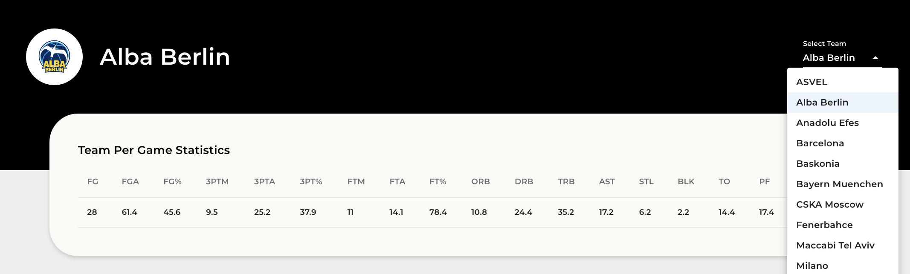

# EuroLeague 2022 Player / Team Analysis Application

This application allows users to view a team's and individual player's season averages, analyze their game-by-game trends by viewing a chosen statistic's game-by-game change in season average and game totals, view a player's percentage contribution to their team total for a particular stat, and evaluate a player's shooting percentages per location on the court. Built using React.js, Express, SQLite, TypeScript, JavaScript, Recharts, and Material UI.

<br />

## Features:

<br />

### 1) Team Per Game Statistics Table and Team Selector Dropdown Menu

- Select a team from the EuroLeague 2022 season in a dropdown menu
- View selected team's traditional per game averages


<br />
<br />

### 2) Team Game Totals and Season Average Line Graph

- Choose a traditional statistic from in dropdown menu
- Analyze a chosen team's game-by-game change in season average and game total for a selected statistic
- Hover over a point on the line graph to view more detail in a custom tooltip


<br />
<br />

### 3) Player Per Game Statistics Table

- View a team roster's traditional per game averages
- Sort roster by a particular statistic in ascending or descending order by clicking on a table header


<br />
<br />

### 4) Player Season Trend for a Selected Statistic

- Choose a traditional statistic from in dropdown menu
- Analyze a chosen player's season trends for a selected statistic


  <br />
  <br />

### 5) Player Game Total and Season Average Line Graph

- Analyze a chosen player's game-by-game change in season average and game total for a selected statistic
- Hover over a point on the line graph to view more detail in a custom tooltip


<br />
<br />

### 6) Player Percentage of Team Total Line Graph

- Analyze a chosen player's percentage of their team's total
- View the game-by-game change in season average and game total percentage for a selected statistic
- Hover over a point on the line graph to view more detail in a custom tooltip


<br />
<br />

### 7) Player Shooting Percentages per Location Bar Graph

- Upon selecting a shooting percentage in the 'Select Statistic' menu, a user can analyze a player's shooting percentages per location on the court
- Hover over a point on the bar graph to view more detail in a custom tooltip


<br />
<br />

## Technologies Used

- Languages:  
- Frontend:
  
  
  
  
  
- Backend:
  
  
  
  

<br />

## Installation

1. In the backend folder, run in the terminal:

```
npm install
```

2. In the frontend folder, run in the terminal:

```
npm install
```

3. In the backend folder, start the backend by running in the terminal:

```
npm start
```

4. In the frontend folder, start the frontend by running in the terminal:

```
npm start
```

5. In the browser, navigate to http://localhost:3000/

<br />

### Owen Iwamasa:

<a href='owiwamasa@gmail.com'>

</a>
<a href='https://www.linkedin.com/in/owen-iwamasa-6ab3a9166/'>

</a>
<a href='https://github.com/owiwamasa'>

</a>
